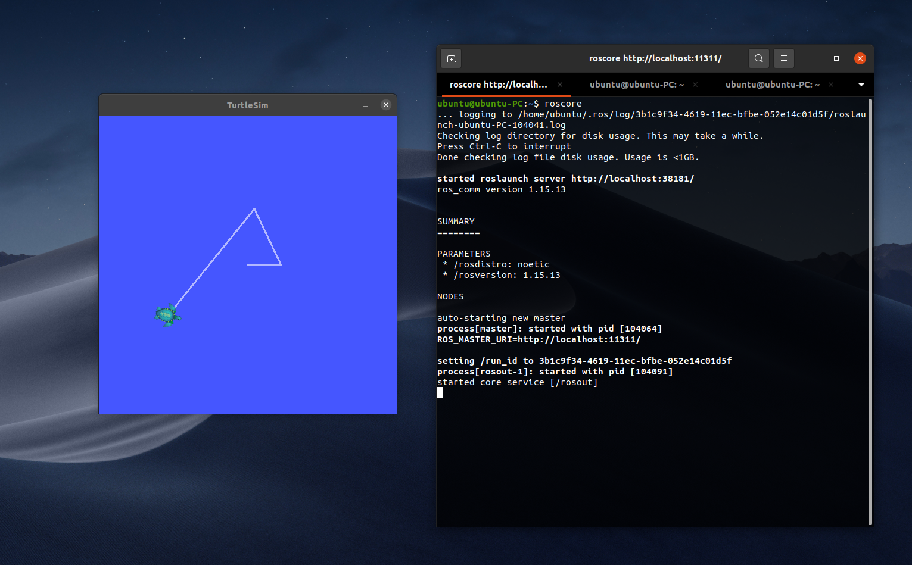
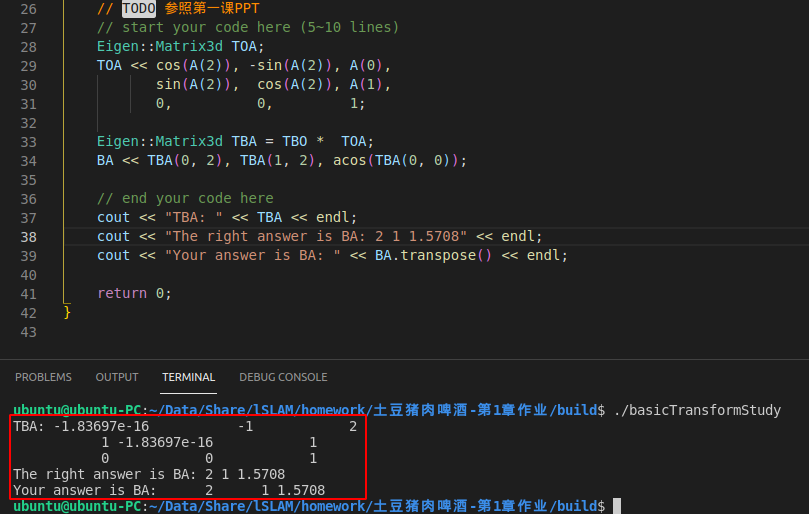

## Task1

1. 三个常用linux命令

`cd` 变换目录
`ls` 列出当前目录下的文件和文件夹
`mkdir` 创建新的文件夹

2. vim

vim是文档编辑器，可以在命令行运行。是vi的拓展版，可以装插件，有彩色高亮提示

* 插入: a或者i，a是在后一个字符位置输入，i是当前位置输入
* 删除: 删除整行用dd，删除单个字符进入编辑模式用backspace删除
* 保存并退出：exc退出编辑模式后输入wq，意思为write and quit

3. 压缩和解压缩

压缩 tar -cvf c为compress v为verbose，显示详细信息，f为file后面要加上需要压缩的文件
解压缩 tar -xvf x为express，其余如上

或者用zip压缩 unzip解压，这两个不是linux自带，需要安装

## Task2

如截图

## Task3

见相应pdf
见相应pdf

## Task4

见代码

