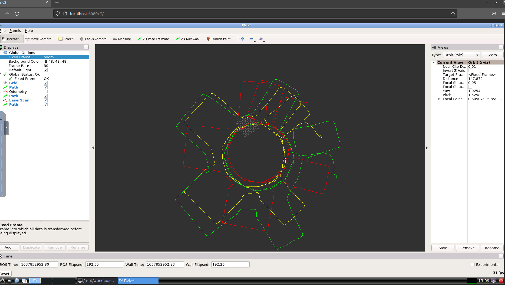
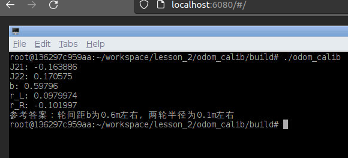
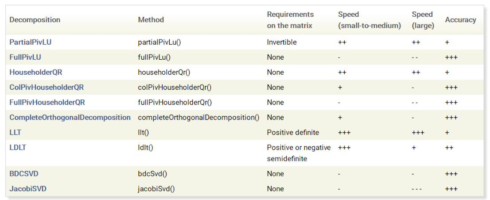

# Task 1

### Question

补充直接线性方法的里程计标定模块代码

### Answer
main.cpp

分别将向量转换为变换矩阵，之后进行乘法预算，再转换为向量返回

```c++
double x, y, theta;

Eigen::Matrix3d T_now;
x = now_pos[0];
y = now_pos[1];
theta = now_pos[2];
T_now << cos(theta), -sin(theta), x,
            sin(theta), cos(theta), y,
            0, 0, 1;

Eigen::Matrix3d T_prev;
x = last_pos[0];
y = last_pos[1];
theta = last_pos[2];
T_prev << cos(theta), -sin(theta), x,
            sin(theta), cos(theta), y,
            0, 0, 1;

Eigen::Matrix3d T = T_prev.inverse() * T_now;

x = T(0, 2);
y = T(1, 2);
theta = atan2(T(1, 0), T(0, 0));
d_pos << x, y, theta;

```

Odom_Calib.cpp

按照ppt上公式分别赋值矩阵A和b

```c++
double ux = Odom[0];
double uy = Odom[1];
double ut = Odom[2];
A.block<3, 9>(now_len % data_len * 3, 0) << ux, uy, ut,  0,  0,  0,  0,  0,  0,
                                    0,  0,  0, ux, uy, ut,  0,  0,  0,
                                    0,  0,  0,  0,  0,  0, ux, uy, ut;
b.block<3, 1>(now_len % data_len * 3, 0) << scan[0], scan[1], scan[2];
```

### Results



# Task 2

### Question

补充基于模型方法的里程计标定模块代码

### Answer

```c++
// 填充A, b矩阵
//TODO: (3~5 lines)
A.block<1, 2>(id_s, 0) << w_Lt, w_Rt;
b[id_s] = s_th;
//end of TODO
w_Lt = 0;
w_Rt = 0;
++id_s;
```

### Results



```c++
Eigen::Matrix<double, 9, 1> x;
x = A.colPivHouseholderQr().solve(b);
// x = A.ldlt().solve(b);  //! ldlt only for pos, neg semi-definite
correct_matrix << x[0], x[1], x[2],
                    x[3], x[4], x[5],
                    x[6], x[7], x[8];
```
# Task 3

### Question

1. 对于该类问题，你都知道哪几种求解方法？
2. 各方法的优缺点有哪些？分别在什么条件下较常被使用？

### Answer

关于求解方法

1. 数值求解，可以参考eigen库
2. 若A可逆，则求逆运算，但直接求逆预算量大
3. 最小二乘法

关于方法之间的比较可按照运算速度和精确度选择

需要注意有些方法需要正定



# Task 4

### Question

设计里程计与激光雷达外参标定方法

### Answer

见pdf [here](./docs/Task4.pdf)