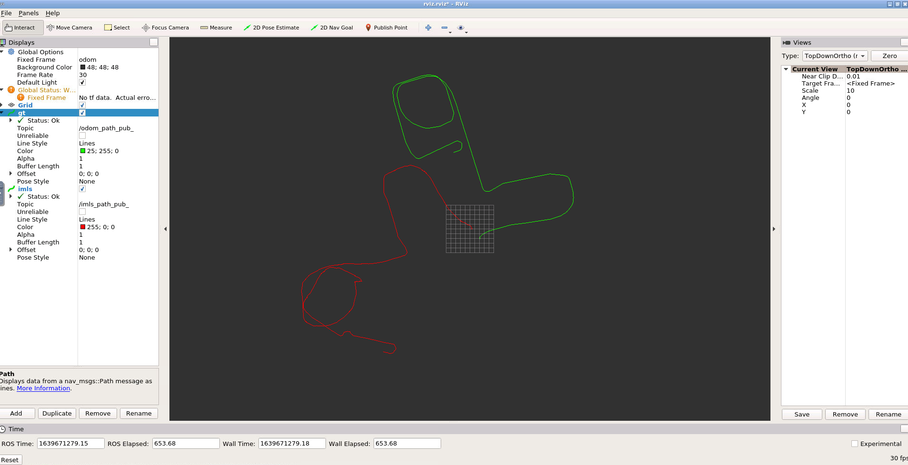
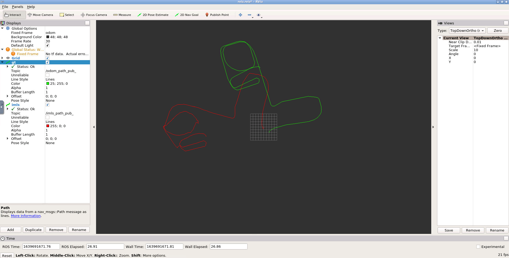

# Task1

任务：实现imls代码

### 关键代码

```c++
    //TODO
    //根据函数进行投影．计算height，即ppt中的I(x)
    Eigen::Vector2d diff;
    for (int i = 0; i < nearPoints.size(); ++i) {
        diff = (x - nearPoints[i]);
        double dist = diff.norm();
        double weight = exp(- (dist * dist) / (m_h * m_h));
        weightSum += weight;
        
        double proj = weight * (diff.dot(nearNormals[i]));
        projSum  += proj;
    }
    height = projSum / weightSum;
    //end of TODO
```

```c++
        //TODO
        //计算yi．
        yi = xi - height * nearNormal;
        //end of TODO
```

```c++
    //TODO
    //根据周围的激光点计算法向量，参考ppt中NICP计算法向量的方法
    //根据周围的激光点计算法向量，参考ppt中NICP计算法向量的方法

    // calculate mean vector
    Eigen::Vector2d mean(0, 0);
    for (const Eigen::Vector2d &p : nearPoints) {
        mean += p;
    }
    mean = mean / nearPoints.size();

    // calculate covariance matrix
    Eigen::Matrix2d sigma = Eigen::Matrix2d::Zero();
    for (const Eigen::Vector2d &p : nearPoints) {
        sigma += (p - mean) * (p - mean).transpose();
    }
    sigma = sigma / nearPoints.size();

    // calculate eigen value and eigen vector
    Eigen::EigenSolver<Eigen::Matrix2d> solver(sigma);
    Eigen::Matrix2d D = solver.pseudoEigenvalueMatrix();
    Eigen::Matrix2d V = solver.pseudoEigenvectors();

    // the eigen vector with smaller eigen value is the norm
    if (D(0, 0) > D(1, 1)) {
        normal = V.col(1);
    } else {
        normal = V.col(0);
    }
    //end of TODO
```

### Result



# Task2

任务：移植csm代码，使用pl-icp算法

### 关键代码

在类中添加以下成员函数和成员变量，同时移除imls相关的代码，修改对应的callback。详情请参考文件[main_csm.cpp](./imlsMatcherProject/src/imlsMatcher/src/main_csm.cpp)

```c++
    // TODO CSM
    void championLaserScanCallbackWithCSM(const champion_nav_msgs::ChampionNavLaserScanConstPtr& msg);

    Eigen::Vector3d PIICPBetweenTwoFrames(LDP& currentLDPScan, Eigen::Vector3d tmprPose);

    void SetPIICPParams()；
    
    LDP m_prevLDP;
    sm_params m_PIICPParams;
    sm_result m_OutputResult;
    // TODO End
```

### Result



发现pl-icp在匹配中期，icp匹配失败，报错如下

```
Valid: 110/1165 invalid: 1055.
PI ICP Failed!!!!!!!
Valid: 110/1165 invalid: 1055.
PI ICP Failed!!!!!!!
Valid: 110/1165 invalid: 1055.
PI ICP Failed!!!!!!!
Valid: 114/1163 invalid: 1049.
PI ICP Failed!!!!!!!
Valid: 114/1163 invalid: 1049.
PI ICP Failed!!!!!!!
Valid: 114/1163 invalid: 1049.
PI ICP Failed!!!!!!!
k=174; I expect C to be a symmetric matrix.
gpc_solve_valid failed
  icp_loop: Cannot compute next estimate.
icp: ICP failed for some reason. 
PI ICP Failed!!!!!!!
k=173; I expect C to be a symmetric matrix.
gpc_solve_valid failed
  icp_loop: Cannot compute next estimate.
icp: ICP failed for some reason. 
PI ICP Failed!!!!!!!
k=229; I expect C to be a symmetric matrix.
gpc_solve_valid failed
  icp_loop: Cannot compute next estimate.
icp: ICP failed for some reason. 
PI ICP Failed!!!!!!!
k=239; I expect C to be a symmetric matrix.
gpc_solve_valid failed
  icp_loop: Cannot compute next estimate.
icp: ICP failed for some reason. 
PI ICP Failed!!!!!!!
```

推测是由于误差累积，导致后期匹配失败。

### 二者对比

对比imls和csm版本pl-icp发现，pl-icp运算速度远快与imls

# Task3

任务：总结icp相关变形以及异同

### Answer

相同点

* 都不知道初始的对应关系，需要迭代求解。
* 都是构建残差方程优化求解。不过有些选取的是位置信息，有些对信息进行抽象得到特征来进行对比。

ICP

* 基本思想是两个点集之间直接匹配。目标函数是与最邻近的点距离之和最小。
* 由于实际中不知道点与点之间的对应关系，只能通过迭代求解。
* 由于点本身是对真实曲面的采样，所以每次采集的点的位置都不一样，匹配会有误差。

PL-ICP

* 在ICP基础上的改进，其思想是点到线的匹配
* 基本思想是一个A中的点到B中点组成的直线的距离最小
* 由于不知道对应关系，依然需要迭代求解

N-ICP

* 充分利用了曲面的特征来对错误的点匹配进行过滤
* 是一种初级的特征提取：法向量和曲率
* 其残差方程除了考虑了欧式距离，还考虑了法向量的角度差和曲率差（特征匹配）
* 由于考虑的特征相对ICP较多，可以排除明显错误的匹配
* 是开源领域最好的ICP匹配方法

IMLS-ICP

* 基本思想是曲面与曲面之间的匹配
* 选择了具有代表性的点，同时保证了选取具有客观性，分布均衡。
* 计算了两个点云代表曲面的距离
* 对实际场景建模更加贴切，但是计算量也会更大。

# Task4

任务：我对ICP方法的改进

### Answer

* ICP除了使用欧式距离，还可以利用每个point的intensive来进行对比（前提有这个信息）
* 对点云进行滤波，比如voxelfilter。这样有两个优点：1. 可以减少计算量 2. 避免某些部分格外稠密，某些部分格外稀疏。
* ICP算法对于初始值更敏感，可以假设匀速直线运动，来提供初始值。如果有其他传感器，可以使用imu或者odom来提供初始值。
* 后期会出现误差累积，加入后端优化。