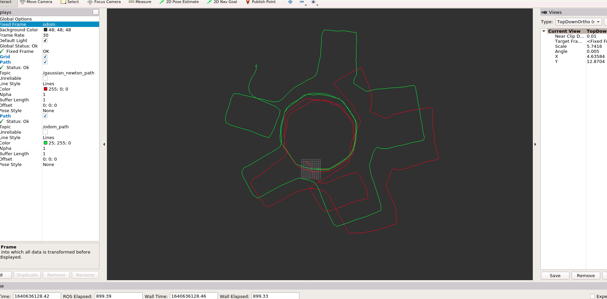
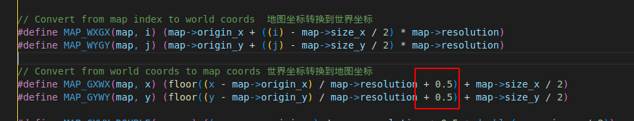

# Task 1

### Result

红色为gaussian_newton法

绿色为odom


发现匹配的效果更差了。估计是部分代码写错，但是检查很久没有检查出来。




# Task 2

问题：

提出一种能提升第一体激光匹配轨迹精度的方法


解答：

我的task1的结果如图并不是很好，其中有一对函数，如下图，彼此转换之间相差0.5




* 我发现，如果不使用提供的转换函数（即，去掉0.5），效果有明显提升，但依旧不是很好。
* H不能保证正定可逆，可以用LM方法替换目前的Gaussian Newton。
* 变换矩阵T应该用李群李代数重新推导Jacoiban公式，因为T存在奇异性


针对第二个H的正定问题，我应用了一个简易版LM算法，如下

```c++
        Eigen::EigenSolver<Eigen::Matrix3d> solver(H);
        Eigen::Vector3cd H_eigen_values = solver.eigenvalues();
        double lambda_min = std::min({H_eigen_values[0].real(), H_eigen_values[1].real(), H_eigen_values[2].real()});

        if (lambda_min <= 0) {
        std::cout << "lambda: " << lambda_min << std::endl;
            H += (-lambda_min + 1) * Eigen::Matrix3d::Identity();
        }
        Eigen::Vector3d delta_T = H.inverse() * b;

```

发现并未改善效果，因为H的正定


# Task 3

### Question 1

NDT的优化函数 score 是什么？


### Question 2

NDT优化求解过程

1. 初始化
   * 空间分配cell
   * 计算每个cell的均值和协方差
2. 匹配
   * for iterations
     * for 激光点
       * 转换坐标系到reference frame
       * 找到对应的cell
       * 根据均值和方差计算梯度g和H
     * end 激光点
     * 更新位姿
   * end iteration

关于g和H的求解公式如下图：


# Task 4

使用了Generic branch and bound的算法，操作如下图

| 操作                                                        | 操作后的节点c | 操作后的C                                | 操作后的Best Score |
| ----------------------------------------------------------- | ------------- | ---------------------------------------- | ------------------ |
| 初始化                                                      | None          | (85 99 98 96)                            | -Inf               |
| C不为空，选取99为节点c，并将它从set中移除                   | 99            | (85 __ 98 96)                            | -Inf               |
| c不是leaf node，且 99 > -Inf，则branch为子节点集合Cc，更新C | 99            | (85 98 96 58 24 87 73)                   | -Inf               |
| C不为空，选取98为节点c，并将它从set中移除                   | 98            | (85 _ 96 58 24 87 73)                    | -Inf               |
| c不是leaf node，且98 > -Inf，则branch为子结点集合Cc，更新C  | 98            | (85 96 58 24 87 73 86 95 70 65)          | -Inf               |
| C不为空，选取96为节点c，并将它从set中移除                   | 96            | (85 _ 58 24 87 73 86 95 70 65)           | -Inf               |
| c不是leaf node，且96 > -Inf，则branch为子结点集合Cc，更新C  | 96            | (85 58 24 87 73 86 95 70 65 89 68 37 15) | -Inf               |
| C不为空，选取95为节点c，并将它从set中移除                   | 95            | (85 58 24 87 73 86 __ 70 65 89 68 37 15) | -Inf               |
| c是leaf node，且95 > -Inf，则将score设置为95                | 95            | (85 58 24 87 73 86 70 65 89 68 37 15)    | 95                 |
| C不为空，选取89为节点c，并将它从set中移除                   | 89            | (85 58 24 87 73 86 70 65 __ 68 37 15)    | 95                 |
| c是leaf node，且89 < 95，bound                              | 89            | (85 58 24 87 73 86 70 65 68 37 15)       | 95                 |
| ...                                                         | ...           | ...                                      | 95                 |
| C不为空，选取85为节点c，并将它从set中移除                   | 85            | (__ 58 24 73 70 65 68 37 15)             | 95                 |
| c不是leaf node，且85 < 95，bound                            | 85            | (58 24 73 70 65 68 37 15))               | 95                 |
| ...                                                         | ...           | ...                                      | 95                 |
| C为空，退出                                                 | None          | ()                                       | 95                 |

过程中，将85节点给bound，其他剩余3个非leaf节点依旧需要细分。