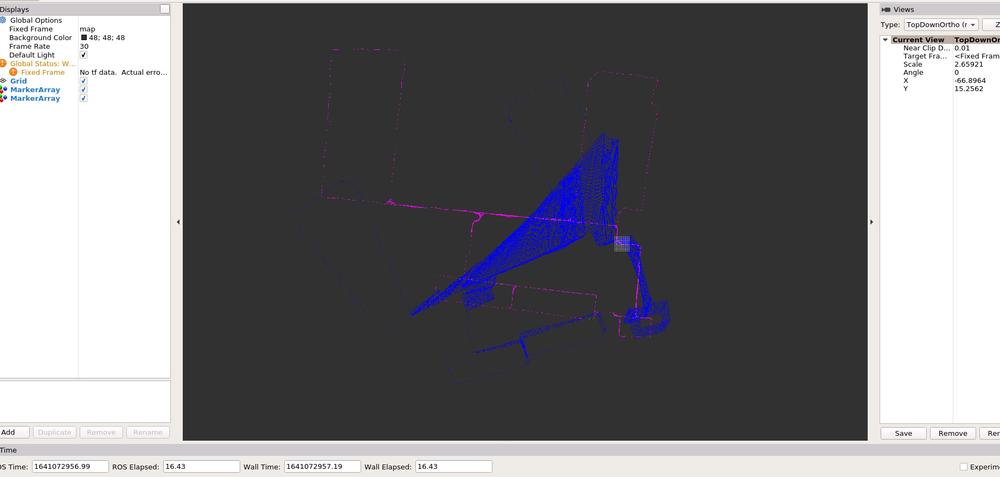

# Task1&2

创建了`timer.hpp`来进行时间测量

创建了`launch`来控制data文件和不同方法

结果如下

### intel


|                             | Final Error | Optimization Time per Iter | Iterations |
| --------------------------- | ----------- | -------------------------- | ---------- |
| inverse                     | None        | Inf.                       | None       |
| colPivHouseholderQr         | None        | Inf.                       | None       |
| ldlt                        | 65.402      | 11.882 s                   | 5          |
| Sparse + SimplicialCholesky | 65.402      | 0.459 s                    | 5          |
| Sparse + SimplicialLDLT     | 65.402      | 0.462 s                    | 5          |

### killian



|                             | Final Error | Optimization Time per Iter | Iterations |
| --------------------------- | ----------- | -------------------------- | ---------- |
| inverse                     | None        | Inf.                       | None       |
| colPivHouseholderQr         | None        | Inf.                       | None       |
| ldlt                        | None        | Inf.                       | None       |
| Sparse + SimplicialCholesky | 10344.7     | 1.466 s                    | 6          |
| Sparse + SimplicialLDLT     | 10344.7     | 1.483 s                    | 6          |

### test_quadrat


|                             | Final Error | Optimization Time per Iter | Iterations |
| --------------------------- | ----------- | -------------------------- | ---------- |
| inverse                     | 49356.5     | 0.00234                    | 3          |
| colPivHouseholderQr         | 49356.5     | 0.00125                    | 3          |
| ldlt                        | 49356.5     | 0.0008                     | 3          |
| Sparse + SimplicialCholesky | 49356.5     | 0.001                      | 3          |
| Sparse + SimplicialLDLT     | 49356.5     | 0.00085                    | 3          |


结论：

* 一般性的线性方程对于intel和killian计算时间过长，用sparse矩阵特性能够加速训练
* 对于小型矩阵，sparse方法反而会变慢，不过影响不大
* 代码中注意角度的正则化
* 通过比较**加载数据时间**， **优化时间**， **更新erticies**时间，得知，**优化**最消耗时间。


改进方法见表格第一列，比较了5中线性方程求解方法。


# Task3

非线性优化方法

1. 最速下降法

   更新方向为负梯度方向，步长需要单独计算

2. 牛顿法

   直接计算Hessian矩阵

3. 近似牛顿法

   不直接计算Hessian矩阵，通过数值方法近似

4. 高斯牛顿法

   用H=J.transpose() * J来表示Hessian

5. LM方法

   为确保H的正定性，用H + lambda * E来代替原来的H，是最速下降法和（高斯）牛顿法的折中。

6. Trust Region方法

   在牛顿法的基础上，引入Trust Region来判断拟合二次型的质量


# Task4

### Ceres方法


### code

详情见main_ceres.cpp

```c++
struct CostFunction {
  CostFunction(const Eigen::Vector3d& measurement) {
    Z_ = PoseToTrans(measurement);
  }

  /**
   * @brief
   *
   * @tparam T
   * @param xi Vertex i double[3]
   * @param xj Vertex j double[3]
   * @param residual double[2]
   * @return true
   * @return false
   */
  template<typename T>
  bool operator() (const T* const xi_x, const T* const xi_y, const T* const xi_theta, const T* const xj_x, const T* const xj_y, const T* const xj_theta, T* residual) const {
    T xix = xi_x[0];
    T xiy = xi_y[0];
    T xitheta = xi_theta[0];
    T xjx = xj_x[0];
    T xjy = xj_y[0];
    T xjtheta = xj_theta[0];

    Eigen::Matrix<T, 3, 3> Xi;
    Eigen::Matrix<T, 3, 3> Xj; 

    Xi << cos(xitheta), -sin(xitheta), xix,
      sin(xitheta), cos(xitheta), xiy,
      T(0), T(0), T(1);
    Xj << cos(xjtheta), -sin(xjtheta), xjx,
      sin(xjtheta), cos(xjtheta), xjy,
      T(0), T(0), T(1);

    Eigen::Matrix<T, 3, 3> E = Z_.cast<T>().inverse() * Xi.inverse() * Xj;

    Eigen::Matrix<T, 3, 1> e;
    e(0) = E(0, 2);
    e(1) = E(1, 2);
    e(2) = atan2(E(1, 0), E(0, 0));

    residual[0] = e.block(0, 0, 2, 1).norm();
    residual[1] = e[2];
    // residual[0] = (0);
  // residual[1] = (0);
  return true;
  }

  static ceres::CostFunction* Create(const Eigen::Vector3d measurement) {
    return (new ceres::AutoDiffCostFunction<CostFunction, 2, 1, 1, 1, 1, 1, 1>(new CostFunction(measurement)));
  }

  //位姿-->转换矩阵
  Eigen::Matrix3d PoseToTrans(Eigen::Vector3d x) const
  {
    Eigen::Matrix3d trans;
    trans << cos(x(2)), -sin(x(2)), x(0),
      sin(x(2)), cos(x(2)), x(1),
      0, 0, 1;

    return trans;
  }


  //转换矩阵－－＞位姿
  Eigen::Vector3d TransToPose(Eigen::Matrix3d trans) const
  {
    Eigen::Vector3d pose;
    pose(0) = trans(0, 2);
    pose(1) = trans(1, 2);
    pose(2) = atan2(trans(1, 0), trans(0, 0));

    return pose;
  }

private:
  Eigen::Matrix3d Z_;
};

```

