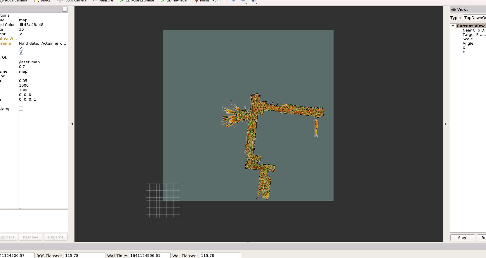
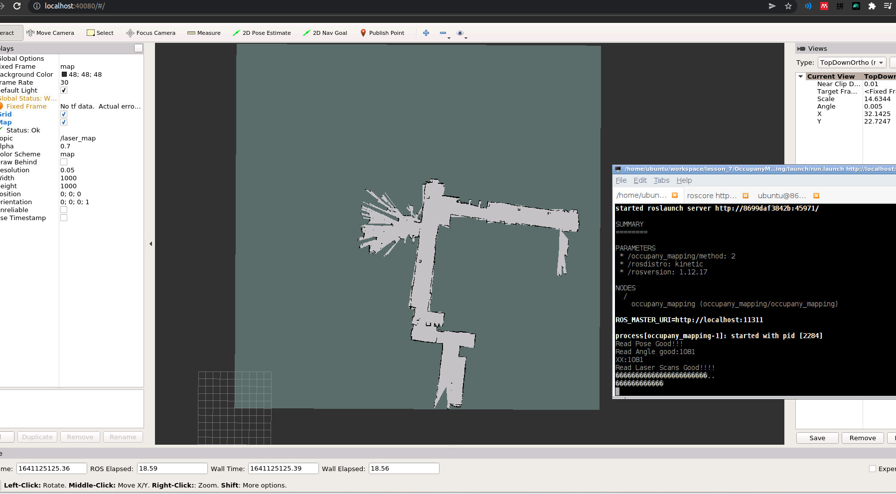
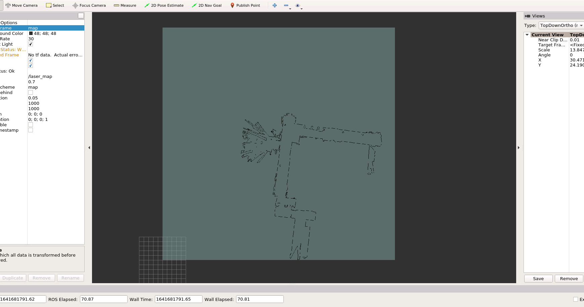

# Task 1

### Code

```c++
            //TODO 对对应的map的cell信息进行更新．（1,2,3题内容）
            GridIndex grid_index = ConvertWorld2GridIndex(world_x, world_y);

            if (!isValidGridIndex(grid_index))
                continue;

            GridIndex robotPose_grid_index = ConvertWorld2GridIndex(robotPose[0], robotPose[1]);

            std::vector<GridIndex> miss_grids = TraceLine(robotPose_grid_index.x, robotPose_grid_index.y, grid_index.x, grid_index.y);

            // method 1
            if (method == 1) {
                for (size_t j = 0; j < miss_grids.size(); j++) {
                    GridIndex tmpIndex = miss_grids[j];
                    int linear_index = GridIndexToLinearIndex(tmpIndex);
                    pMap[linear_index] += mapParams.log_free;
                    pMap[linear_index] = (pMap[linear_index] < mapParams.log_min ? mapParams.log_min : pMap[linear_index]);
                    // pMap[linear_index] = std::max(mapParams.log_min, double(pMap[linear_index]));
                }

                //更新被击中的点
                int linear_index = GridIndexToLinearIndex(grid_index);
                pMap[linear_index] += mapParams.log_occ;
                pMap[linear_index] = (pMap[linear_index] > mapParams.log_max ? mapParams.log_max : pMap[linear_index]);
                // pMap[linear_index] = std::min(mapParams.log_max, double(pMap[linear_index]));
            }
```


### Result

备注：初始化地图pMap值都为50



# Task 2

### Code

```c++
            // method2
            if (method == 2) {
                // 更新被经过的点
                for (size_t j = 0; j < miss_grids.size(); j++) {
                    GridIndex tmpIndex = miss_grids[j];
                    int linear_index = GridIndexToLinearIndex(tmpIndex);
                    pMapMisses[linear_index]++;
                }

                //更新被击中的点
                int linear_index = GridIndexToLinearIndex(grid_index);
                pMapHits[linear_index]++;
            }
```

未经过区域：50

穿过区域：0

击中区域：100

```c++
    //TODO 通过计数建图算法或TSDF算法对栅格进行更新（2,3题内容）
    static double ratio_threshold = 0.3;
    if (method == 2) {
        for (int i = 0; i < mapParams.width * mapParams.height; ++i) {
            int sum = pMapHits[i] + pMapMisses[i];
            if (sum == 0) {
                pMap[i] = 50;
                continue;
            }
            double ratio = double(pMapHits[i]) / sum;

            if (ratio > ratio_threshold) {
                pMap[i] = 100;
            }
            else if (ratio <= ratio_threshold) {
                pMap[i] = 0;
            }
        }
    }
```


### Result



# Task 3

### Code

考虑激光打中点后的far_point，多加三个像素

```c++
            // * method 3
            if (method == 3) {
                double t = 2 * mapParams.resolution;  // cut off distance

                // calculate far point
                double far_dis = dist + 3 * mapParams.resolution;

                double far_laser_x = far_dis * cos(angle);
                double far_laser_y = far_dis * sin(angle);

                double far_world_x = cos(theta) * far_laser_x - sin(theta) * far_laser_y + robotPose(0);
                double far_world_y = sin(theta) * far_laser_x + cos(theta) * far_laser_y + robotPose(1);

                GridIndex far_grid_index = ConvertWorld2GridIndex(far_world_x, far_world_y);

                std::vector<GridIndex> near_grids;

                if (isValidGridIndex(far_grid_index) == false) {
                    near_grids = TraceLine(robotPose_grid_index.x, robotPose_grid_index.y, grid_index.x, grid_index.y);
                }
                else {
                    near_grids = TraceLine(robotPose_grid_index.x, robotPose_grid_index.y, far_grid_index.x, far_grid_index.y);
                }

                for (size_t j = 0; j < near_grids.size(); j++) {
                    GridIndex tmpIndex = near_grids[j];
                    double grid_dis = sqrt(pow(tmpIndex.x - robotPose_grid_index.x, 2) + pow(tmpIndex.y - robotPose_grid_index.y, 2));

                    grid_dis *= mapParams.resolution;

                    double tsdf = std::max(-1.0, std::min(1.0, (dist - grid_dis) / t));

                    int linearIndex = GridIndexToLinearIndex(tmpIndex);

                    pMapTSDF[linearIndex] = (pMapW[linearIndex] * pMapTSDF[linearIndex] + tsdf) / (pMapW[linearIndex] + 1);
                    pMapW[linearIndex] += 1;
                }

```


对map进行更新，对地图进行遍历

```c++
    if (method == 3) {
        std::vector<std::pair<int, int>> boundaries{ {0, 1}, {0, -1}, {-1, 0}, {1, 0} };
        for (int i = 0; i < mapParams.width; ++i) {
            for (int j = 0; j < mapParams.height; ++j) {
                GridIndex centerIndex;
                centerIndex.SetIndex(i, j);
                int center_linearIndex = GridIndexToLinearIndex(centerIndex);
                for (auto& boundary : boundaries) {
                    GridIndex boundaryIndex;
                    boundaryIndex.SetIndex(i + boundary.first, j + boundary.second);
                    if (isValidGridIndex(boundaryIndex)) {
                        int boundary_linearIndex = GridIndexToLinearIndex(boundaryIndex);
                        if (pMapTSDF[center_linearIndex] * pMapTSDF[boundary_linearIndex] < 0) {
                            if (abs(pMapTSDF[center_linearIndex] < abs(pMapTSDF[boundary_linearIndex]))) {
                                pMap[center_linearIndex] = 100;
                            }
                            else {
                                pMap[boundary_linearIndex] = 100;
                            }
                        }
                    }
                }

            }
        }
    }

```


### Result




# Task4

|              | 优点                                                         | 缺点                                                         |
| ------------ | ------------------------------------------------------------ | ------------------------------------------------------------ |
| 覆盖栅格建图 | 不需要额外一次整体更新，只需要一次加法                       | 边界不一定能累积到max值，且中间区域显示为噪点。最好加上一个后续处理。 |
| 计数建图     | 实现简单                                                     | 内存占用两个变量Hits和Misses                                 |
| TSDF         | 1. 假设了高斯分布的噪声 2. 地图边缘只有一个像素厚度 3. 可以插值得到具体位置，不局限于分辨率 | 无法区分未探索区域和穿过区域；不适用非高斯分布；计算量较大   |

